# BERT: Pre-training of Deep Bidirectional Transformers for Language Understanding

- Pre-training
  - 在大数据集上预先训练，然后用在目标任务中
  - （模型在 A 训练集上训练，用于 B 任务）
- Bidirectional Transformers
  - 双向的 Transformer

# Abstract
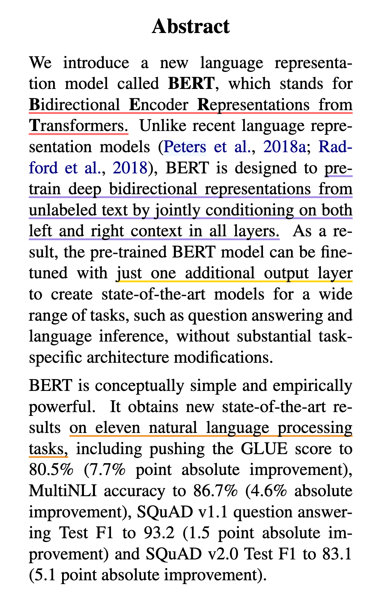
- Bidirectional Encoder Representation from Transformers
  - Transformer 模型双向的编码器表示
- BERT 的使用场景
  - 使用没有标记的左右（上下文）信息来训练深的双向的表示
  - 与 GPT 的区别，GPT是只用左边的数据，去预测右边的数据
- BERT 的使用方式
  - **只需要增加一个输出层**，不需要根据特定的任务对模型进行特定改动
    - 得益于 Transformer 架构
  - 与 ELMo 的区别
    - ELMo 使用的是 RNN 架构，需要根据特定任务对模型进行相应的修改
- 解释 BERT 的绝对精度，以及和其他任务相比的相对精度优势

# 1. Introduction
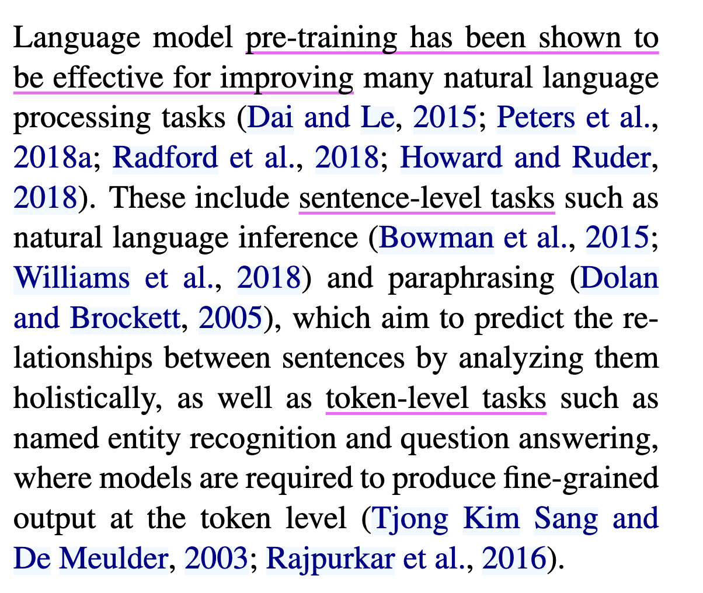
- 预训练可以提升模型的能力
- NLP 中的预训练通常应用于两类任务
  - sentence-level tasks
    - 识别句子间的关系
  - token-level tasks
    - 识别人名
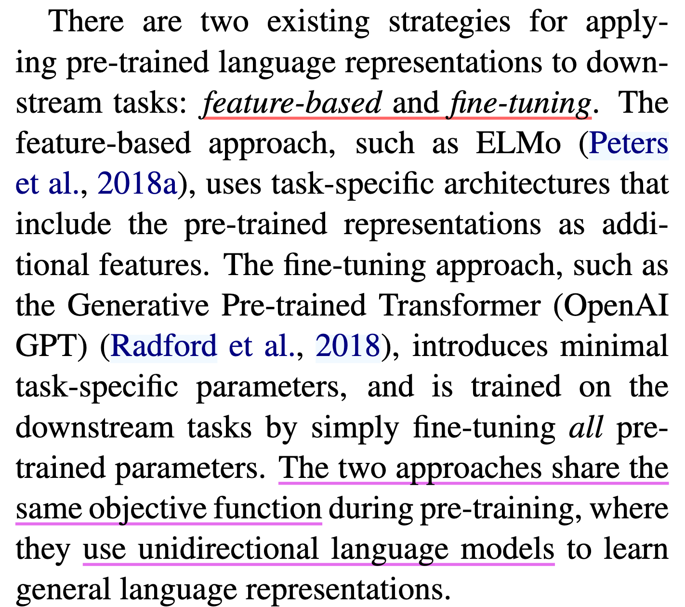
- 预训练的两种方式
  - Feature-based: i.e., ELMo
    - 构建和每一个下游任务相关的 NN 架构；训练好的特征（作为额外的特征） 和 输入 一起放进模型
  - Fine-tuning: i.e., GPT
    - 所有的权重参数根据新的数据集进行微调
- 现有预训练方式的缺点
  - unidirectional: 单向
  - 使用相同的目标函数
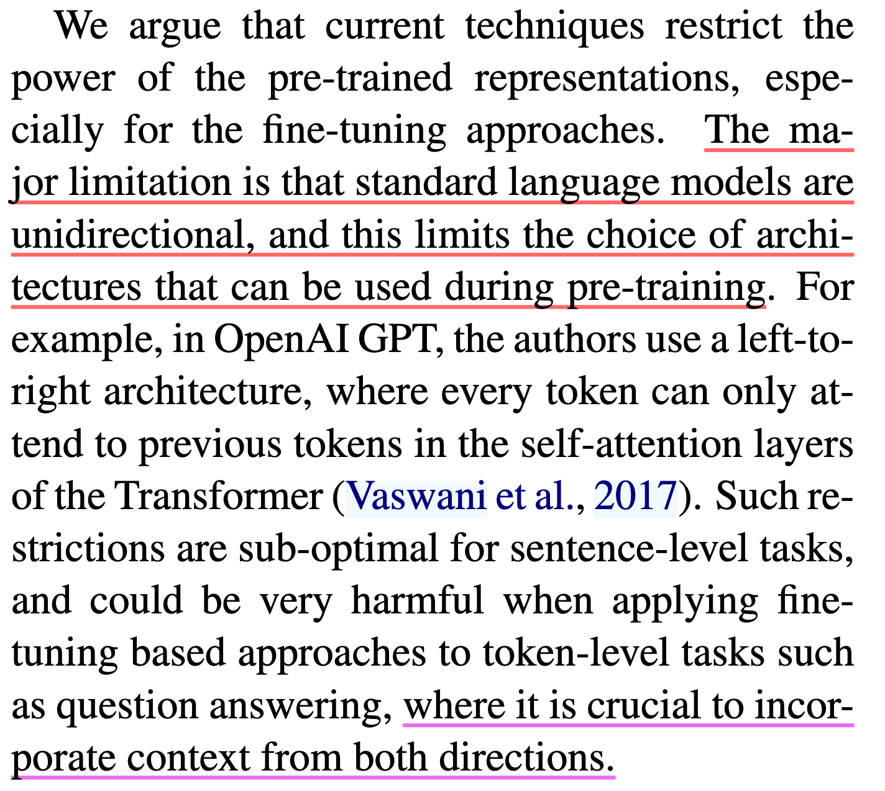
- 当前技术的局限性
  - 标准语言模型是单向的，这就限制了模型架构的选择
    - GPT 从左到右的架构，只能将输入的一个句子从左看到右
    - 但是对于某些任务来说，从左到右和从右到左应该都是被允许的（双向）
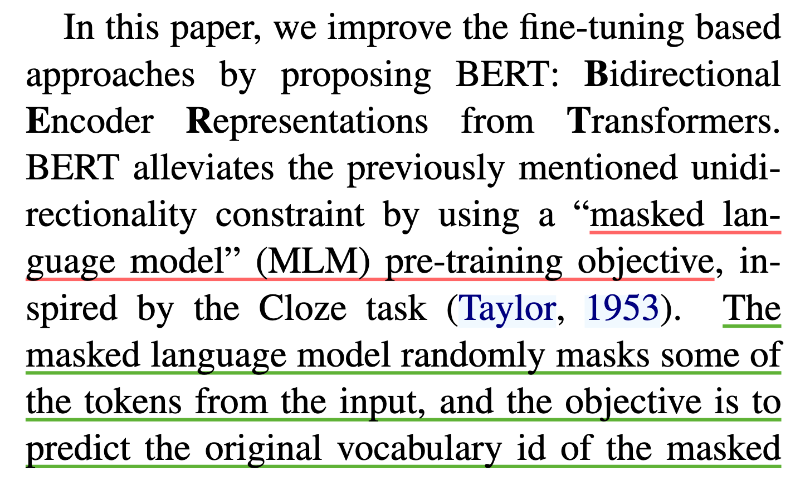
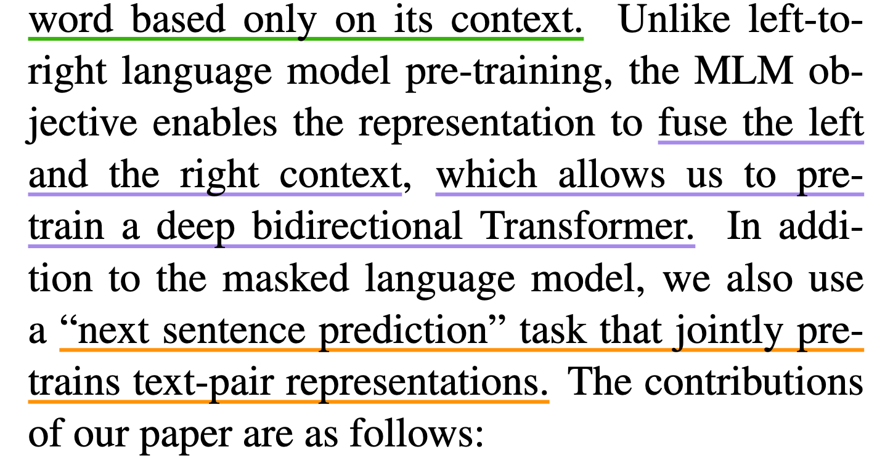
- 本文的解决方法
  - BERT 通过**MLM**作为预训练的目标，来减轻语言模型的单向约束
  - NSP: next sentence prediction 
    - 判断两个句子是随机采样的，还是原文相邻，学习 sentence-level 的信息
- 什么是 MLM
  - 每次随机选输入的词源 tokens, 然后 mask 它们，目标函数是预测被 masked 的词；类似挖空填词、完形填空
- 与标准语言模型有什么区别（从左到右的单向）
  - MLM 可以看**左右的上下文信息**, pre-train deep bidirectional transformer 的基础
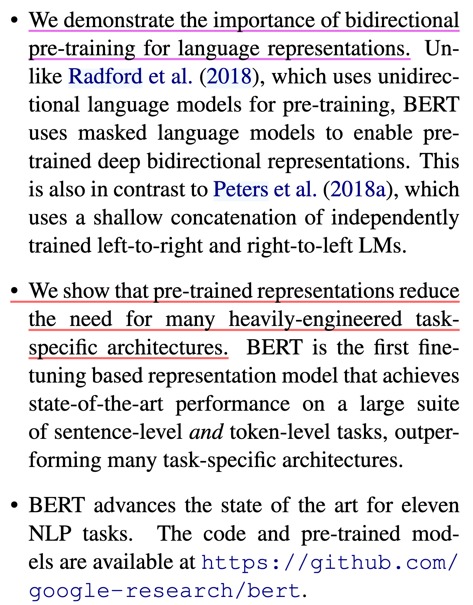
- 本文贡献
  - 1. 证明双向信息的重要性
  - 2. 证明好的预训练模型，不用对特定任务做一些模型架构的改动
  - 3. 开源

# Conclusion
- 拓展前任的结果到 deep bidirectional architectures，使同样的预训练模型能够处理大量的 NLP 任务

# 3. BERT
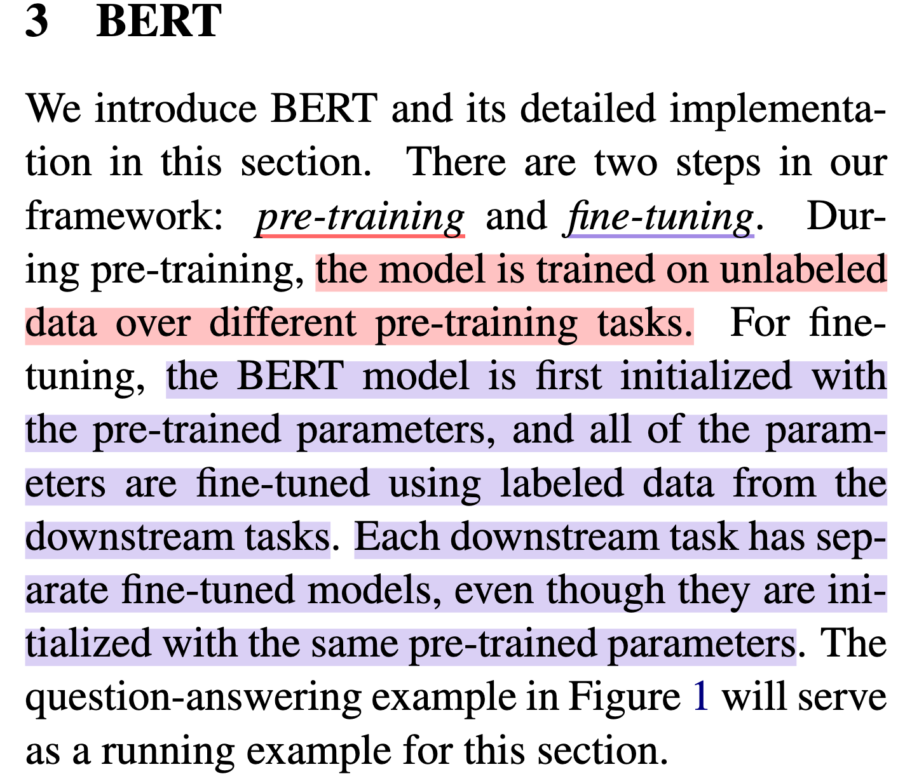
- BERT 的步骤
  - 1. Pre-Training: 使用 unlabeled data 训练 
  - 2. Fine-Tuning
    - Fine-Tuning 的 BERT 使用预训练得到的参数进行初始化
    - 根据下游任务的不同，微调 BERT 的参数，并针对每一个下游任务，都初始化一个新的 BERT 模型

## 3.1. Model Architecture
- 一个多层双向 Transformer 的解码器，基于 transfomer 的论文和代码
- 模型调整了三个参数
  - L: transform blocks的个数
  - H: hidden size 隐藏层大小
  - A: 自注意力机制 multi-head 中 head 头的个数
- BERT 能处理不同句子数量的下游任务
  - 一个句子 a single sentence
  - 一个句子对 a pair of sentences
- BERT 的输入和 transformer 区别
  - transformer 预训练时候的输入是一个序列对。编码器和解码器分别会输入一个序列
  - BERT 只有一个编码器，为了使 BERT 能处理两个句子的情况，需要把两个句子并成一个序列
- 切词方法：wordPiece
  - 低频词
    - 切开，只保留一个词出现频率高的子序列，可能会是词根，词根出现的频率会更大
  - 否则
    - 空格切词
  - 这样做的好处
    - 有效减少词典大小，否则，词典集中在嵌入层，也就会导致模型的可学习参数大都分布在嵌入层
- BERT 输入构成方式: `[CLS]`  +  `[SEP]`
  - `[CLS]`
    - 出现在序列的第一个
      - 自注意力机制使得 `[CLS]` 可以感知到句子的剩余部分，与它所在的位置无关
    - 输出句子层面的信息 sequence representation
  - `[SEP]`
    - 表示句子隔断，出现在每个句子的最后
    - 还有一种分割句子的方法：学一个嵌入层 来表示 整个句子是第一句还是第二句
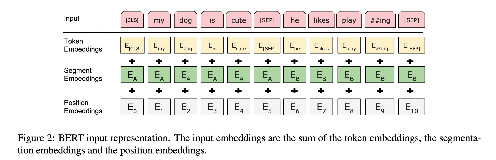
- For a given token, 进入 BERT 的表示 = token 本身的表示 + segment 句子的表示 + position embedding 位置表示
- 一个词源的序列 >> 一个向量的序列 >> 进入 transformer 块
  - Token embeddings:  词源的embedding层，整成的embedding层， 每一个 token 有对应的词向量
  - Segement embeddings: 这个 token 属于第一句话 A还是第二句话 B
  - Position embedding: token 词源在这个序列 sequence 中的位置信息。从0开始 1 2 3 4 --> 1024
- BERT input representation = token embeddings + segment embeddings + position embeddings 
  - 其中，segment embedding （属于哪个句子）和 position embedding （位置在哪里）是学习得来的
  - TRANSFORMER 的 position embedding 是一个给定的矩阵

## 3.1. Pre-Training BERT
### 3.1.1. MLM
- 由 WordPiece 生成的词源序列中的词源，它有 15% 的概率会随机替换成一个掩码。但是对于特殊的词源不做替换，i.e., 第一个词源 `[CLS]` 和中间的分割词源 `[SEP]`
  - 如果输入序列长度是 1000 的话，要预测 150 个词
- MLM 带来的问题
  - 预训练和微调看到的数据不一样。预训练的输入序列有 15% `[MASK]`，微调时的数据没有 `[MASK]`
  - 解决方法
    - 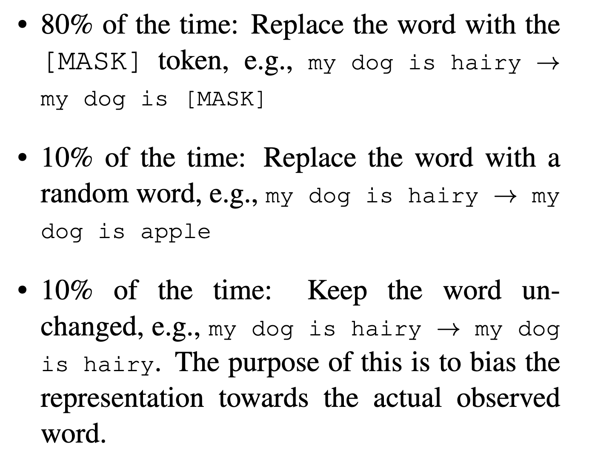
    - 被选中替换成`[MASK]`的词中
      - 80% 的概率被替换为 `[MASK]
      - 10% 换成 random token，即从字典中随机选择一个词进行替换
      - 10% 不改变原 token

## 3.1.2. NSP
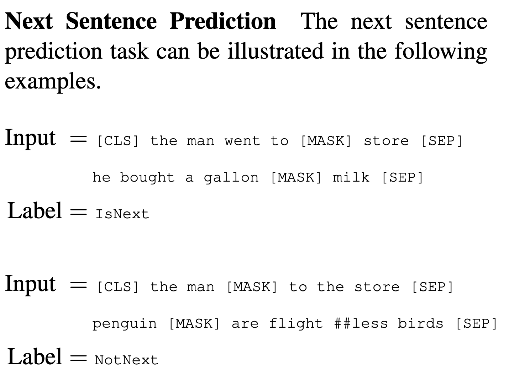
- 输入序列有 2 个句子 A 和 B，50% 正例，50%反例
  - 50% B 在 A 之后，50% 是 a random sentence 随机采样的

## 3.2. Fine-Tuning BERT
- 整个句子对被放在一起输入 BERT，self-attention 能够在两个句子之间相互看。BERT 更好，但代价是 不能像 transformer 做机器翻译
  - 在encoder-decoder的架构，编码器看不到解码器的东西
- BERT 用作下游任务
  - 根据下游任务，设计我们任务相关的输入和输出
  - 优点
    - 模型不怎么变，加一个输出层 softmax 得到标号 label