# 1. 数据处理基础
## 1.1. Data Process
- **Categorical Feature 需要被处理**
  - 例如：国籍（中国、美国等等）
  - 方式
    - 例如一共有 197 个国家
    - 可以将中国、美国、日本等等依次设置为 1、2、3...（并不是表示大小），**并再转换为 197 维的向量**
    - 即中国 = `[1, 0, 0,...]`，美国 = `[0, 1, 0, ...]`，日本 = `[0, 0, 1,...]`（one - hot）
    - **需保留0**，以代表国籍缺失或者为止
  - 不能直接只用数字进行编码而需要使用 one - hot 编码的原因
    - 如果直接使用数字，则会出现日本 3 = 中国 1 + 美国 2，然后这个关系并不成立
    - 而日本 + 美国 可以被表达为 `[0, 1, 1,...]`，即某人拥有日本和美国的双国籍
- Numeric Feature 可以被直接使用
  - 例如：年龄（18、30）
  - 例如：性别（Male、Female），但需转换为 0/1

- Age、Gender 和 Nationality 组合合成 199 （1 + 1 + 197）维的向量

## 1.2. Processing Text Data

1. Tokenization （Text to Words）
   - 即将句子分割成单词
2. Count Word frequencies
   - 使用 Hash 表计算词频
     - 若该词出现在表中，则增加其 Value
     - 若该词未出现在表中，则增加 Key
   - 统计词频，按照词频降序排序，并赋予编号
   - 去除低频词
     - 方式
       - 姓名
       - 错拼词
     - 作用
       - 降低 one - hot 编码的维度

# 2. Text Processing and Word Embedding

- 背景
  - 将 50k 条电影评论进行二分类，即**正面**评价和**负面**评价
  - 在进行机器学习前，需要进行文本处理，即将文本处理成**Sequence**（Text to Sequence）
  - 处理的好坏能直接**影响最终的结果**

## 2.1. Text to Sequence 

- 目的
  - 将每个 Text 数字化

1. **Tokenization**

   - Definition
     - 将文本拆分为更小的单元
   - Example
     - 将 Text[i] = My name is Fitz 分割成 Sequence[i] = ["My", "name", "is", "Fitz"]

   - Problem
     - 大小写
     - 拼写错误

2. **Build Dictionary**

   - Definition
     - 将每个 Toekn 作为 Key，值为该 Token 对应的索引
   - Example
     - My: 1, name: 2, is: 3, Fitz: 4

3. **Encoding**

   - Definition
     - 将 Sequence 根据 Dictionary 转换为对应的 Vector
   - Example
     - Sequence[i] = [1, 2, 3, 4]

4. **Align Sequences**

   - Definition
     - 使得每条数据的长度相同
   - Example
     - Sequence 过短时，增加空格
     - Sequence 过长时，截断

## 2.2. Word to Vector

- 目的
  - 将 Text 转换为 Vector
- One - hot Encoding
  - Defintion
    - 每个单词都被转换成一个长向量，这个向量的长度等于词汇表中的单词总数。向量中只有一个元素是1，代表当前的单词，其余都是0
  - Example
    - [1, 0, 0], [0, 1, 0], [0, 0, 1]
  - Drawback
    - 当 Word 的总数过大时，采用 one - hot 向量就会导致向量的维度过大（每个不同的单词都会增加一个维度）
    - Dict 中有 v 个词，向量就会有 v 维
- Reduce dimension
  - 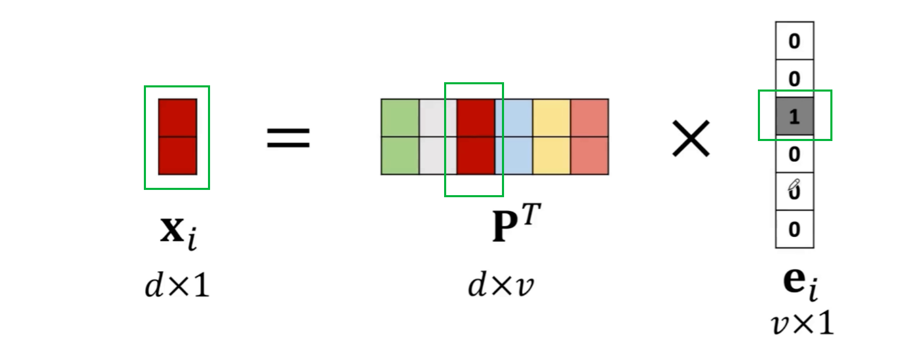
  - Definition
    - 使用**参数矩阵**p降低维度，使用 $d \times v$
    - $d$ 为**用户自行决定**，代表的是降维后的 Vector 的维度；$d$ 的维度越高，模型的表现越好
    - $v$ 是原词向量的维度
    - $p$ 的**每一行**代表了一个词向量，图为 $p$ 的转秩，故每列代表一个词向量
    - **具有相似意思的 word，在向量空间中的位置相近**

# 3.Recurrent Neural Networks(RNN)
## 3.1. Basic Knowledge of RNN
- Definition
  - 处理一对多、多对一或多对多的输出/输出
- Structure
  - 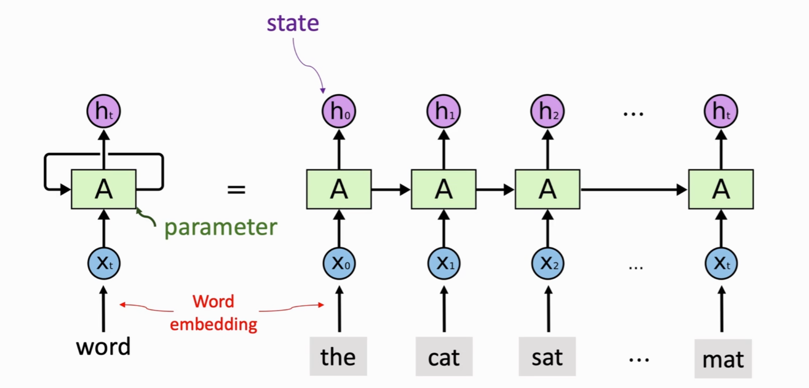
    - $X_t$ 表示当前输入，即 Sequence[i] 经过**word embeding**后转换为词向量后作为输入
    - $h_t$ 表示隐藏状态，包含了**到目前为止**的**整个序列**的信息
      - $h_t$ 是根据 $h_{t-1}$ 和当前输入得到 
      - $h_t$ 包含了整个 Sequence 的信息
    - $A$ 表示模型参数，$h$ 基于 $A$ 的参数不断迭代
- $h_t$ 
  - 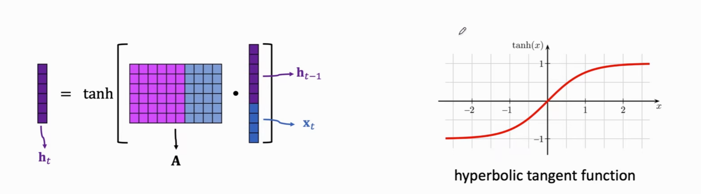
    - 将 $h_{t-1}$ 和 $x_t$ 进行拼接，和模型参数 $A$ 进行乘法运算，再用 $tanh$ 激活函数处理，最终得到 $h_t$ 
    - $tanh$ 激活函数是在 0 - 1 之间，故 $h_t$ 也是
- $tanh$ 的作用
  - 保证模型在接受若干个输入后，应该在合适的区间内，**输出不会过大或过小**

## 3.2. Simple RNN
- Structure
  - 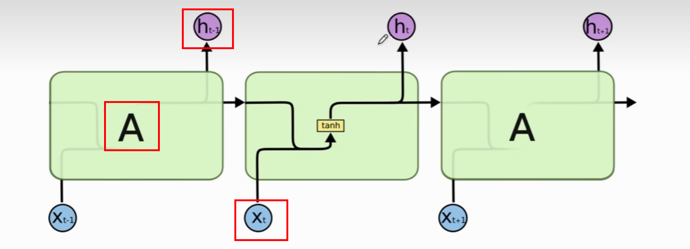
  - $h_t$ 的输出依赖于 $h_{t-1}$ $x_t$ 和 $A$，最终经过 $tanh$ 激活函数
- Drawback
  - RNN 无法很好的处理 long - term 数据（会遗忘很早之前的输入），只适合处理较短的数据
  - 假设对 $x_1$ 进行修改，**它几乎不会影响**到 $h_{100}$，即 $\frac{\partial h_{100}}{\partial x}\approx 0$
  - Example
    - 我是一个中国人，...我能很流利的说____
    - 这里应该填入**汉语**，如果两句话中间隔很短，RNN可以准确预测汉语这个词；但是如果间隔过长，则只能判断出应该填入语言类，而非确定汉语

# 4. LSTM
- Definition 
  - 解决了 RNN 中无法处理 long - term data 的问题
  - **有选择的**让信息延续下去

## 4.1. Structure
- Gate
  1. Forget Gate 
    - 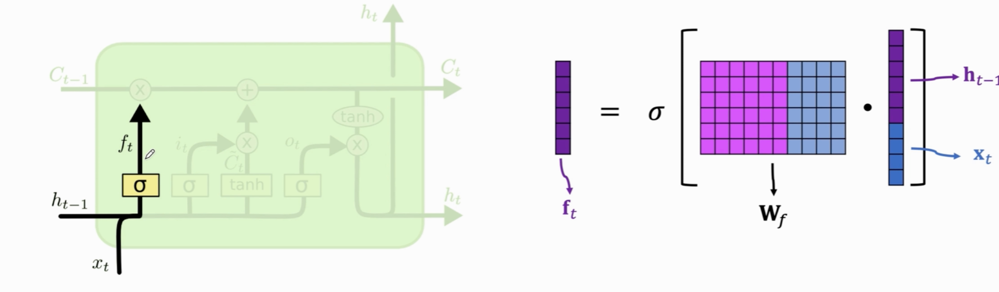
    - Definition
      - 对当前的输入 $x_t$ 和 之前信息 $h_{t-1}$ 进行拼接，并与遗忘门的参数矩阵 $W_f$ 进行乘法运算，再经过 $sigmod$ 激活函数**（将数据压缩到 0 - 1 之间）**，最终得到 $f_t$，即 $f_t$ 的最终结果每个元素也都是 0 - 1 之间；当为 0 时表示不让通过，为 1 时表示全部通过；
    - Funtion
      - 决定哪些信息被遗忘
  2. Input Gate
    - Definition
      - 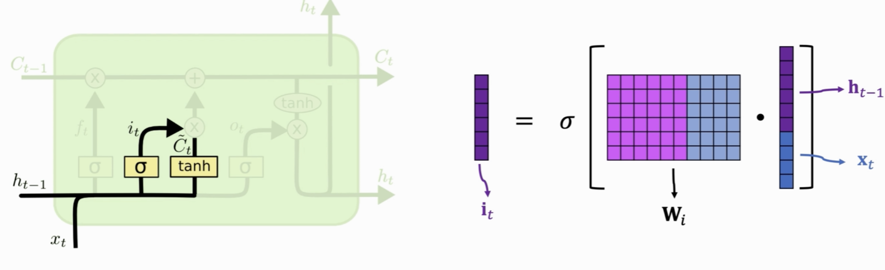
      - 这里分成两个部分
        1. $i_t$ 的计算部分和 Forget Gate 的计算一致，但是 $w_i$ 和 $w_f$ 的参数并不一致
        2. $C_t$ 的计算部分和 Forget Gate 的计算大致相似，区别是激活函数变为了 $tanh$，且 $w_c$ 也是**独立参数**
  3. Output Gate
    - Definition
      - 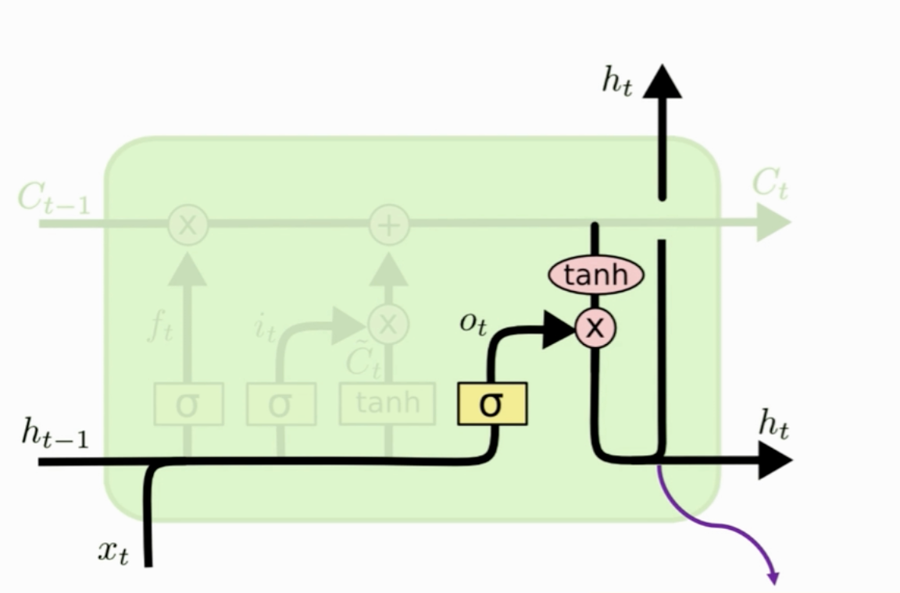
      - 计算基本和之前类似
- Convert belt 
  - 过去的数据 $C_{t-1}$ 和 $C_t$ 的交互经过传送带完成

# 4.2. Procedure
  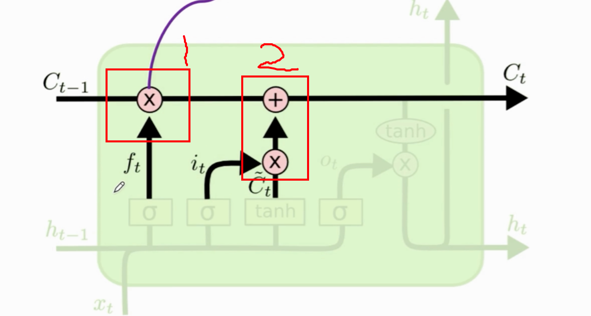
  1. $C_{t-1}$ （之前的数据）和 $f_t$ （由遗忘门获得）相乘，**决定哪些数据被遗忘**（1 表示完全保留，0 表示完全遗忘，之间表示部分保留）
     - 选择性保留一部分数据
  2. $i_t$ 和 $C_t$ 是维度相同的向量，因此，直接经过相乘后，可以使用加法与 $C_{t-1}$ 相加
     - 添加新的元素
  3. 输出
     - 对 Convert belt 的输出 $C_t$ 进行 $tanh$ 激活函数，压至 -1 到 1 之间，再与 $o_t$ 相乘得到 $h_t$
     - $h_t = o_t \cdot tanh(c_t)$ 
     - $h_t$ 会有两份 copt
       - 一份作为下一个 $h_{t-1}$
       - 一份作为输出

# 5. Text Predition
- Procedure
  - Training Data
    - Pair: [segment, next_char]
    - 定长的数据段和该数据段的下一个字符
      - 定长数据段为输入
      - 下一个字符为 Label
    - Example
      - segment:I am Fit, next_char: z
  - Trained Model
    - Input
      - 字符串
    - Output
      - 在经过 Softmax 层后（最后一层），得到下一个字符的概率分布，有两种方法决定下一个字符
        1. 贪心（选择最高概率）
        2. 随机采样
- Essence
  - 多分类任务
    - 例如一共有 10000 个单词，本质上就是从这 10000 个单词中选择出最高概率的那个
  - 可以生成全新的数据

# 6. Seq2Seq Model
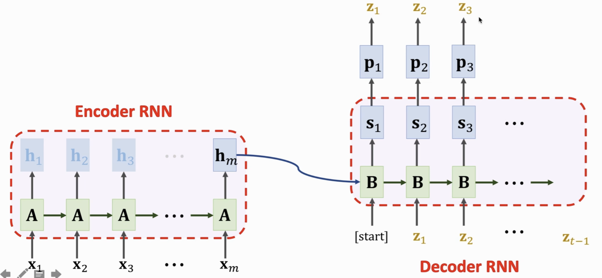
## 6.1. Encoder
- Function
  - 从输入中提取特征
- 输出
  - $h_t$ 和 $C_t$，即最后一个隐藏状态和传送带的最后一个状态

## 6.2. Decoder
- Essence
  - Text Prediction
  - 不同之处
    - Text Predition 的初始状态是全0
    - Decoder 的初始状态是 Encoder 的输出，其概括了 Encoder 的输入的语义
- 输出
  - 下一个字符的概率分布

## 6.3. Procedure of Training
- 使用英语训练 Encoder，得到 $h_t$ 和 $C_t$，再作为输入给 Decoder
  - 这里的 $h_t$ 和 $C_t$ 是 Encoder 最终的隐藏状态和记忆单元，分别代表编码器**最后一步的状态**
  - 这些状态会被传递给 Decoder **作为其初始状态**
- 使用德语的起始字符作为输入给Decoder
  - 计算Decoder 的预测（向量）和实际的第一个字符（向量）的Loss，再经过反向传播更新 Decoder 和 Encoder
- 输入起始字符和第一个字符
  - 计算Decoder 的预测和实际的第二个字符的Loss，再经过反向传播更新 Decoder 和 Encoder
- 每次都增加一个字符，以此类推，直到输入为整句字符

## 6.4 Procedure of Inference
- 输入英语给 Encoder，得到 $h_0$ 和 $C_0$
  - 目的：获取英语语义
- 将 $h_0$、$C_0$ 和 [start] 起始符号作为输入给 Decoder，得到下一个字符（由概率分布得到）、$h_1$ 和 $C_1$ 
  - 同理 Text Prediction
- 将 $h_1$、$C_1$ 和 $z_1$ 第一个字符作为输入给 Decoder，得到下一个字符、$h_2$ 和 $C_2$
- 不断重复，直到输出结尾符号

## 6.5. Shortcoming
当输入的句子过长时，会导致模型记不住之前的某些单词

# 7. Attention
## 7.1. 特性
  - 会估计之前的所有输入
  - 告诉`Decoder`应该关注哪个部分
  - 这也不可避免导致计算量增大

## 7.2. 原理
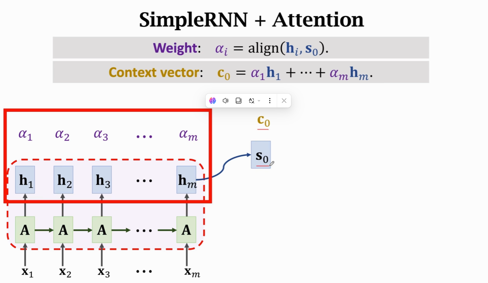
  1. 在 Encoder 完成后，Decoder 和 Attention **同时开始工作**
  2. Decoder 的所有 $h$ 状态**都需要被保留**，且 $h_m$（即 Encoder 最后一个状态）作为 $s_0$ （即 Decoder 的第一个状态） 
     - 这里是和 Seq2Seq 的区别 
  3. 计算 $s_i$ 与之前每一个 $h_i$ 的**相关性**（$h_1 ... h_m$）得到**相应**的 $\alpha_i$ 
     1. $k_i=W_K\cdot h_i$ ($W_K$ is obtained from training data)
        - Linear Maps 
     2. $q_0=W_Q\cdot s_0$ ($W_Q$ is obtained from training data)
        - Linear Maps  
     3. $\tilde{\alpha_i}=k^T_i\cdot q_0$
        - Inner product
     4. $[\alpha_1,...\alpha_m]=Softamax([\tilde{\alpha_1},...\tilde{\alpha_m}])$
        - Normalization 
     - $\sum\alpha_i=1$
     - $C_i=\alpha_1 h_1 + ... + \alpha_m h_m$
       - $\sum\alpha_i \cdot h_i$

## 7.3. SimpleRNN + Attention （总结）
- 图为机器翻译的过程，Encoder是对原语言进行特征提取，Decoder是生成对应语言
- Encoder
  - $x_i$ 表示原语言的所有输入（向量形式），经过 $A$ （表示 Encoder 的参数）后，得到相对应的状态向量 $h$，其中，$h_m$ 包含了整个 Encoder 的**所有信息**（概括信息）
- Decoder
  - 根据 $S_{i-1}, C_{i-1},x'_{i-1}$ 生成 $x_{i},S_i$
    - $x_i$ 表示当前模型的输出，即下一个词的预测
    - $S_i$ 是当前的状态向量
    - $C_i$ 表示当前的状态向量和 Encoder 的每一个 $h$ （状态向量）的**相关性**
      - 结合了 Encoder 的所有信息
      - 由 $\sum(\alpha_i+h_i)$ 得
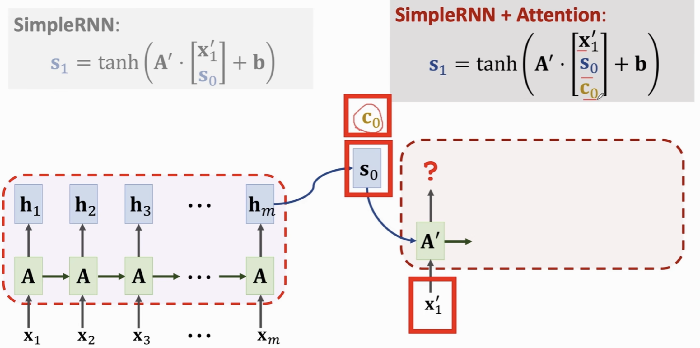
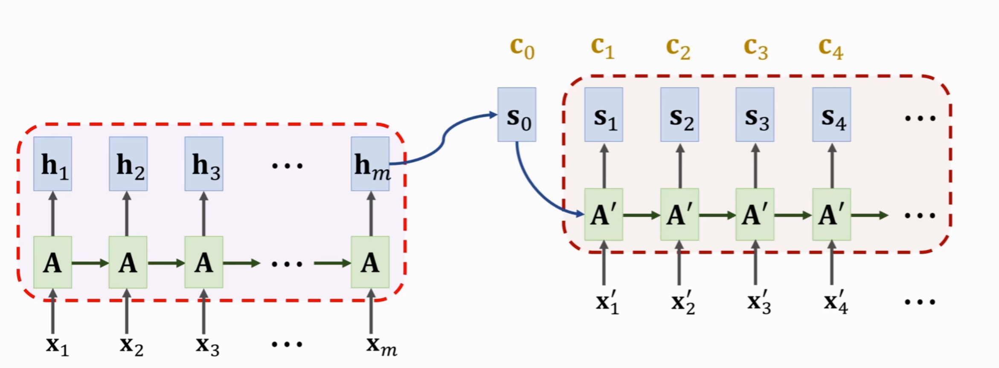
1. $S_i$ 结合了 $x'_i,s_{i-1},c_{i-1}$
   - 这里与普通的 SimpleRNN 相比，结合了 $C_{i-1}$ 的信息，而 $C_{i-1}$ 里面包含了 Encoder 的 m 步的所有信息，解决了 SimpleRNN 的**遗忘问题**
2. 在每一轮 $S_i$ 输出后，都要重新计算基于当前 $S_i$ 的 $C_i$ 用于下轮计算
   - 这也是为什么 Attention 的**计算量庞大**的原因

## 7.4. Forcs on ($\alpha_i$ 的意义)
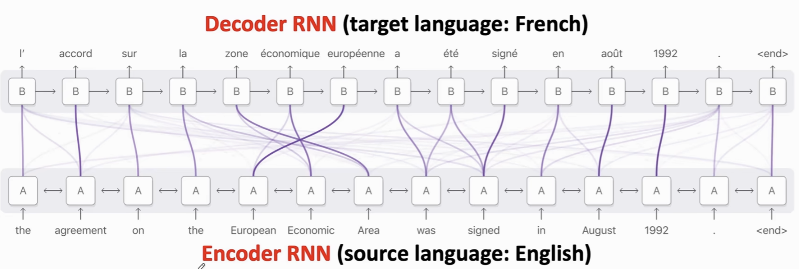
- $\alpha_i$ 表示当前的 $S_i$ 和 Encoder 中的**每一个** $h$ 的**相关性**
- 图中紫色线条表示相关性强弱，颜色越深越强；这种相关性可以使得模型关注与该结点相关性最强的对应结点

# 8. Self-Attention
- 以 Simple RNN + Self - Attention 为例：状态向量 $h_i = tanh(A\cdot[x_i, c_{i-1}]^T+b)$
  - Simple RNN 中 $h_i = tanh(A\cdot[x_i, h_{i-1}]+b$，即区别是将 $h_{i-1}$ 替换为 $C_{t-1}$ 
  - $C_i=\sum(\alpha _i+h_i)$
    - $\alpha _i = align(h_j,h_i)$，其中，$j=1,2,...i$
      - 需要和自身进行相关性计算，即自相关；例：i = 3时，j = 1，2，3