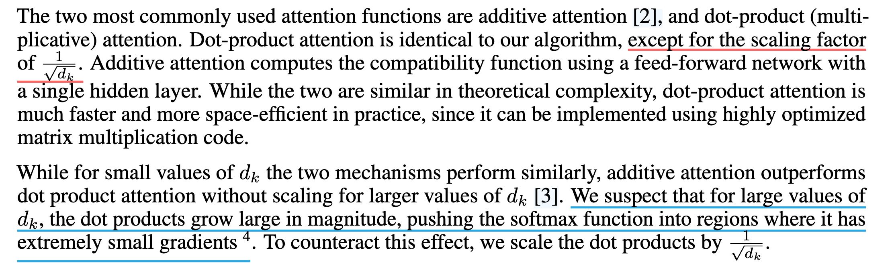

# Abstract

- SOTA model是用 Encoder、Decode 和 Attention 的架构
  - 当时仅局限于机器翻译
- 本文特点
  - 不使用循环和卷积的结构
  - 并行性更强
  - 训练时间更少

# Conclusion

- 使用**多头自注意力层**代替循环层
- 训练时间快很多
- 未来方向的预测

# 1. Introduction

1. 指出 RNN 的缺点
   - **缺乏并行性**
     - RNN 需要顺序性，$h_t$ 的生成需要**顺序生成**前 $t-1$ 个 $h$ (即必须保证$t-1$ 个 $h$ **已经生成**)
       - $h$ 是隐藏状态，$h_t$ 包含了前 $t-1$ 个结点的所有信息
       - 这也是为什么 RNN 能很好的处理时序信息的原因
   - **内存开销大**
     - 如果 $t$ 过大，则会导致需要计算的 $h_t$ 也相应增大
2. 关于 RNN 的相关改进并没有从根本上解决问题
3. Attention 的作用是建立 Encoder 和 Decoder 的连接，**将 Encoder 的信息传给 Decoder**
4. Transformer **完全使用注意力机制**（减少时序计算），使得并行性增加，训练时间减少

# 2. Background

1. 卷积层对长时间序列的数据难以建模；相比之下，一层 Multi-Head Attention 就能实现多层卷积层的效果，同时可以维持卷积层的多输出通道的效果
  - 卷积覆盖范围较小，如果两个点距离过远，需要很多卷积层进行堆叠才能相交互
2. 自注意力机制
3. 端到端记忆网络

# 3. Model Architecture

-  Encoder-Decoder结构
   -  Encdoer
      -  根据输入 $x_1, ... x_n$ 生成对应的向量 $z_1, ... z_t$
   -  Decoder
      -  将向量 $z_1, ... z_t$ 输入到 Decoder 后，它输出 $y_1, ... y_m$ (n 并不等于 m)
   -  Auto-regressive 模型
      -  即是输入也是输出
         -  Decoder 的输出是顺序输出的
         -  Decoder 的输出 $y_t$，需要输入 $y_{t-1}$
         -  过去时刻的输出是当前时刻的输入

- Transformer **延续了 Encoder-Decoder 架构**
  - 由自注意力机制、point-wise和全连接层堆叠而成
- Encdoer 
  - 输入是源句
  - word(input) >> Vector >> Nx Attention Block >> Decoder (Attention Block)
- Decoder
  - 训练时，采用掩蔽机制
  - 预测时无输入，**自回归模型**
    - **每轮的输入是上一轮的输出**（图中的shifted right的意思）
    - 最开始的输入是开始符号
    - input(Auto-regressive) >> Vector >> Nx Attention Block (including **Masked Multi-Head Attention**) >> Linear >> Softmax >> Probabilities

## 3.1. Encoder and Decoder Stacks

1. Encoder
   - Encoder 的 Attention Block 有六个
   - Attention Block 中含有两个子层
     - Multi-head Self-Attention
     - positionwise fully connected feed-forward network
      - 本质是个 MLP
   - 对子层使用残差连接和层归一化
   - 输出公式为 $LayerNorm(x+Sublayer(x))$
     - $Sublayer(x))$ 表示 x 经过子层的输出
     - $x + Sublayer(x))$ 表示残差连接
     - $LayerNorm(x+Sublayer(x))$ 表示归一化后的输出
   - 固定输出维度为 512
     - 残差需要输入和输出的维度一致
     - 和普通的神经网络不同
   - 只有两个参数可以调整，一个是 Attention Block 的个数，一个是维度 d 的大小

2. Decoder
   - 增加了一个多头注意力机制
   - 在训练的时候**使用 Mask** 遮蔽 t 时后的输入
     - 模拟在预测时，只能依靠 t 时刻前的信息

### Layer Normalization 与 Batch Normalization
- Function of Normalization
  - 减少梯度消失的问题
  - 每层特征输入激活函数前，进行归一化，将其转换为均值为0，方差为1的数据
- Batch Normalization
  - 对**每个特征的所有样本**进行归一化
- Layer Normalization
  - 对**每个样本的所有特征**进行归一化
  - 适用于**变长数据**
- Example
  - 二维
    - 
  - 三维
    - '

## 3.2. Attention
- 给定 Query，计算它与所有键 K 的兼容性分数（常用点积）
  - $score(Q,K_i)=Q\cdot K_i$
- Softmax 为权重
  - $\alpha_i=softmax(score(Q,K_i)$)
- 对所有的值 $V_i$ 进行加权求和，得到最终输出
  - $output=\sum\alpha_i V_i$

## 3.2.1. Scaled Dot-Product Attention

- 1. 点乘 $Q$ 与所有 $K$ 得到内积，表示相似度
  - 即 $k_1,\cdots,k_n$
- 2. 除以 $\sqrt{d_k}$
- 3. 使用 $Softmax$ 得到相对应的 $V$ 的权重 

- 并行计算
  - $Q$ 和 $K$ 的维度 $d_k$相同，所以可以相乘得到一个 $n*m$ 的矩阵
    - $n$ 和 $m$ 分别表示 $Q$ 和 $K$ 矩阵中具体 $query$ 和 $key$ 的个数
    - $n*m$ 的矩阵中的每一行表示一个 $query$ 对所有 $key$ 的内积值
  - 对每一行除以 $\sqrt{d_k}$ 后，进行 $softmax$ 归一化处理
  - 乘以 $V$，得到 $n*d_v$ 的矩阵
    - $n*d_v$ 的矩阵的每一行都表示最后的输出

- 和普通的点积相比，Attention 增加了一个 $\frac{1}{\sqrt{d_k}}$
- 这样的好处是避免了当 $d_k$ 过大时，值间的相对差距会过大，在经过 Softmax 后，大的值会更加接近 1，其他值也会相应的更加接近0，即两极分化
  - 进而导致梯度变小

- mask
  - 注意力机制有可以对 $k_1,\cdots,k_n$ 进行计算的特点
  - Transformer 中为了避免在 $t$ 时刻使用到了 $t+1,\cdots,t+n$ 时刻的信息，提出了 mask
  - 具体来说就是将 $k_t,\cdots,k_n$ 的值替换成一个非常大的负数
  - 使得它们在 Softmax 后，这些值都会无限接近 0